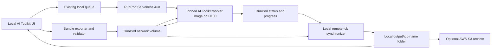

# Reproducible remote training on RunPod

Status: implemented behind `AI_TOOLKIT_RUNPOD_ENABLED=1`; real-H100 acceptance still requires operator credentials
Last documentation review: 2026-07-26

## Security first

The RunPod API key pasted into chat must be revoked and replaced before enabling or testing this integration. A RunPod key is a bearer credential: anyone who has it can create billable resources.

The replacement key must:

- be supplied to the local AI Toolkit server as `RUNPOD_API_KEY`;
- never be written to a job config, training bundle, manifest, log, URL, command-line argument, or browser response;
- never be sent to the remote training container;
- not be stored in the existing `Settings` SQLite table, because that table is not encrypted at rest;
- be redacted from exceptions and HTTP diagnostics.

The UI exposes only `configured: true/false` and a **Test RunPod connection** action. Environment configuration takes precedence, matching the cloud-captioning secret pattern.

## Implemented operator quick start

1. Revoke the RunPod key previously exposed in chat and create a replacement. The implementation has not used or stored the exposed value.
2. Choose a RunPod datacenter offering H100 Serverless capacity and the network-volume S3 API.
3. Build and push the worker with `remote/runpod/build_worker.ps1`. It refuses a dirty worktree or mutable base-image reference and prints the pushed immutable digest.
4. Plan and then create the RunPod volume, template, and endpoint with `remote/runpod/provision.py` as documented in `infra/runpod/README.md`. It uses the official REST API because the current official Terraform provider fails Terraform schema validation. The endpoint is strict H100, `workersMin=0`, supports one to three workers through `--max-concurrent-jobs`, and has no GPU fallback.
5. The bootstrap references a read-only Hugging Face token through the RunPod secret `aitk_hf_read` and gives the worker only `HF_TOKEN`, `AITK_WORKER_IMAGE_DIGEST`, and `AITK_REQUIRE_H100=1`. Do not give it the RunPod controller key, volume S3 credentials, an AWS profile, or AWS credentials.
6. Start the local UI with controller variables modeled by `remote/runpod/runpod.env.example`, including the network volume's datacenter ID as the S3 signing region. Non-secret endpoint/volume/digest fields may instead be saved on Settings.
7. On Settings, choose **Maximum concurrent H100 jobs** from one to three, then run **Save and test RunPod**. Submission is blocked unless the endpoint has at least that many maximum workers, zero minimum workers, exactly H100, the expected volume, and the immutable worker image (when exposed by the API).
8. Create or edit a training job, choose **RunPod Serverless H100**, set an integer training seed, then start its independent `runpod:h100` queue.

The existing job page consumes mirrored `log.txt`, `loss_log.db`, samples, checkpoints, and LoRAs. Numbered `.safetensors` checkpoints are exposed during training only after AI Toolkit advances beyond their save step; the worker hashes them and the controller verifies that hash before making them visible locally. A graceful Stop writes a control object that the worker translates into its private SQLite database. Force Cancel is deliberately separate. **Continue +500 Steps** creates a new attempt, verifies resume compatibility, restores the prior verified output tree, and can recover a missing local parent bundle from the volume by checksum. Local-to-remote resume is intentionally rejected until local checkpoint inventories can meet the same verification contract.

The local controller may optionally archive a completed bundle and verified artifacts to AWS S3 with `AI_TOOLKIT_AWS_ARCHIVE_ENABLED=1` and standard AWS credential resolution such as `AWS_PROFILE=echoflicks`. Provision the private archive bucket from `infra/aws-archive`; those credentials never enter a bundle or RunPod request.

## Recommendation

Keep the local AI Toolkit UI as the control plane and add a provider-neutral remote execution backend. The UI should export an immutable training bundle, submit a reference to that bundle to RunPod, mirror progress and artifacts into the normal local output folder, and stop remote billing automatically.

The recommended first RunPod backend is a **queue-based Serverless endpoint**:

- H100 GPU;
- Flex workers;
- `workersMin: 0`;
- `workersMax: 1-3`, matching the controller's `RUNPOD_MAX_CONCURRENT_JOBS` cost ceiling;
- `idleTimeout: 5` seconds;
- asynchronous `/run` requests;
- a per-job execution timeout, initially 3 hours;
- a job TTL long enough to cover queue time plus execution, initially 6 hours;
- one attached RunPod network volume.

This matches the requirement to queue occasional jobs without paying for an idle GPU. RunPod starts a worker for a queued request and scales it back to zero after the request finishes. The endpoint configuration remains, but no GPU worker remains active.

An ephemeral **RunPod Pod backend** can be added later. Pods have a lower active H100 hourly price and more direct control, but our application would be responsible for provisioning, watching, exporting results, and terminating every Pod. A crashed local coordinator can leave an orphaned billable Pod, so a Pod backend needs an independent hard-termination safeguard.

Do not run a second copy of the complete AI Toolkit web UI on RunPod. Do not upload the live working tree and install dependencies for every job. Build one pinned worker image and send only immutable job bundles.

## Why Serverless fits this workflow

RunPod queue endpoints provide the lifecycle operations the local UI needs:

- `POST https://api.runpod.ai/v2/{endpoint_id}/run`
- `GET https://api.runpod.ai/v2/{endpoint_id}/status/{remote_job_id}`
- `POST https://api.runpod.ai/v2/{endpoint_id}/cancel/{remote_job_id}`
- progress updates emitted by the worker handler

RunPod currently allows execution timeouts and TTLs up to seven days. Async API results are retained for only 30 minutes, so model files and monitoring data must be placed in durable storage rather than returned in the API response.

Official references:

- [Serverless endpoint overview](https://docs.runpod.io/serverless/endpoints/overview)
- [Endpoint settings and scale-to-zero controls](https://docs.runpod.io/serverless/endpoints/endpoint-configurations)
- [Async requests, policies, and result retention](https://docs.runpod.io/serverless/endpoints/send-requests)
- [Status and cancellation operations](https://docs.runpod.io/serverless/endpoints/operation-reference)
- [Worker progress updates](https://docs.runpod.io/serverless/workers/handler-functions)

## Proposed architecture



The existing UI should continue reading:

- `output/<job-name>/log.txt` for the terminal;
- `output/<job-name>/loss_log.db` for the Loss Graph;
- `output/<job-name>/samples/` for samples;
- the local `Job` row for status, step, speed, and information.

The synchronizer makes remote execution look like local execution by populating those same files and fields.

## Training bundle contract

The exporter should create a bundle such as:

```text
analog-horror-v2-<bundle-sha256>.tar.gz
├── dataset/
│   ├── 0001.png
│   ├── 0001.txt
│   └── ...
├── train.template.yaml
└── manifest.json
```

The exporter must work from copies. It must never rename, rewrite, resize, or recaption the original dataset during export.

### Pre-export validation

Reject the export when:

- an image has no matching non-empty caption;
- a Gemini refusal, API error, or diagnostic message appears to be a caption;
- filenames collide after normalization;
- an unsupported image type is present;
- `[trigger]` is absent or occurs more than once when the selected template requires it;
- the trigger word is empty;
- local Windows paths remain in the portable config;
- any referenced control, mask, adapter, or resume file is outside the bundle;
- the source tree is dirty and no explicit source snapshot has been recorded;
- the base-model revision is unpinned.

### Portable paths

The exported YAML should contain logical placeholders, not machine paths:

```yaml
training_folder: "${AITK_OUTPUT_ROOT}"
datasets:
  - folder_path: "${AITK_DATASET_DIR}"
sqlite_db_path: "${AITK_CONTROL_DB}"
model:
  name_or_path: "${AITK_MODEL_DIR}"
```

The worker resolves placeholders after unpacking. The resolved config should be saved beside the results as `config.resolved.yaml`.

### Manifest contents

At minimum, `manifest.json` should record:

- bundle schema version and bundle ID;
- SHA-256 of every image, caption, and config file;
- canonical config SHA-256;
- dataset file count and supported extension list;
- trigger phrase and expected `[trigger]` count;
- caption provider, exact Gemini model ID, prompt, prompt-template ID, and captioning timestamp;
- AI Toolkit Git commit and branch;
- Docker image name and immutable image digest;
- Python, PyTorch, CUDA, TorchAO, Diffusers, and optimizer-package versions;
- base model repository, exact Hugging Face revision, and downloaded file hashes;
- LoRA rank/alpha, optimizer, learning rate, batch size, gradient accumulation, precision, quantization, checkpointing, seed, total steps, resolution buckets, and sample prompts;
- requested GPU type and actual GPU type reported by the worker;
- creation timestamp and optional parent-run ID for resumed experiments.

The completed run should add a `run-manifest.json` containing the actual environment, output hashes, wall-clock times, and remote provider IDs.

## What “replicable” can mean

The goal is a reproducible experiment specification, not guaranteed bit-for-bit identical weights across a local RTX 5090 on Windows and an H100 on Linux.

Different GPU architectures, CUDA kernels, attention implementations, and floating-point reduction order can change the numerical trajectory even with the same seed. The integration can guarantee:

- byte-identical dataset and captions;
- identical semantic training configuration;
- pinned source code, container, dependencies, and base model;
- recorded hardware and runtime details;
- comparable checkpoints and sample prompts.

It cannot promise identical loss values or identical `.safetensors` bytes across different hardware.

Hardware tuning must be an explicit experiment variant. The remote launcher must not silently change `low_vram`, quantization, gradient checkpointing, batch size, learning rate, steps, sampling, or optimizer settings. A later **Optimize for H100** action may create a cloned config with a new config hash; it must not mutate the comparable run.

## Container and model pinning

Build a dedicated worker image from the custom branch. Pin it by digest when creating the RunPod template or endpoint.

The image should contain:

- the exact AI Toolkit commit;
- the Python environment and compiled dependencies;
- the RunPod handler and remote runner;
- AWS/S3 and archive utilities only when required;
- no API keys, Hugging Face tokens, AWS profiles, datasets, or user captions.

Do not `git pull` or install from floating package versions at job startup.

Krea 2 Raw should be downloaded at an exact Hugging Face revision into the network-volume cache. The worker should rewrite `name_or_path` to that verified local snapshot. This avoids a floating `krea/Krea-2-Raw` reference changing between local and remote experiments.

## Storage design

### RunPod network volume: recommended working storage

Use one RunPod network volume for:

- Hugging Face/model cache;
- uploaded training bundles;
- active job directories;
- checkpoints and optimizer state;
- progress events and samples awaiting local synchronization.

It is mounted at `/runpod-volume` for Serverless workers and `/workspace` for Pods. RunPod exposes selected network-volume datacenters through an S3-compatible API, so the local application can upload and download files without starting GPU compute.

This storage still incurs a small storage charge while idle, but not a GPU charge. Attaching a volume restricts the endpoint to its datacenter and may reduce H100 availability. Choose a datacenter that supports both the S3-compatible volume API and H100 workers.

References:

- [RunPod network volumes](https://docs.runpod.io/storage/network-volumes)
- [RunPod S3-compatible API](https://docs.runpod.io/storage/s3-api)

### AWS S3: useful as an archive and provider-independent handoff

AWS S3 is beneficial for:

- immutable bundle retention;
- final checkpoint/archive retention after RunPod cleanup;
- disaster recovery independent of RunPod;
- sharing a bundle with a different compute provider later;
- S3 object checksums and lifecycle policies.

The existing local `echoflicks` AWS CLI profile can perform local upload/download/archive operations. The profile itself must remain local. Never copy its credentials directory into the bundle or worker image.

For an MVP, use the RunPod network volume for live transfer and optionally archive the final bundle/results to AWS S3. There is no need to make the RunPod worker an AWS principal in that version.

If direct worker-to-AWS transfer is added later, use narrowly scoped temporary STS credentials or short-lived presigned URLs. Do not send the long-lived `echoflicks` credentials to RunPod. Presigned GET URLs can be generated by the AWS CLI and are valid for at most seven days. Variable output filenames are better handled by an STS session restricted to a single `jobs/<job-id>/` prefix than by a long list of presigned PUT URLs.

References:

- [AWS CLI `s3 presign`](https://docs.aws.amazon.com/cli/latest/reference/s3/presign.html)
- [AWS temporary credentials](https://docs.aws.amazon.com/IAM/latest/UserGuide/id_credentials_temp_use-resources.html)
- [AWS S3 checksum behavior](https://docs.aws.amazon.com/cli/latest/topic/s3-faq.html)

## Remote job protocol

The local UI should submit only identifiers and hashes, not the dataset or credentials inline:

```json
{
  "input": {
    "schemaVersion": 1,
    "executionId": "EXECUTION_UUID",
    "requestKey": "sha256:REQUEST_DIGEST",
    "bundleKey": "bundles/CONTENT_DIGEST/ARCHIVE_DIGEST.tar.gz",
    "bundleContentDigest": "sha256:CONTENT_DIGEST",
    "bundleArchiveSha256": "ARCHIVE_DIGEST",
    "runPrefix": "runs/EXECUTION_UUID",
    "expectedWorkerImageDigest": "registry/image@sha256:IMAGE_DIGEST",
    "resumePrefix": "runs/OPTIONAL_PARENT_EXECUTION_UUID"
  },
  "policy": {
    "executionTimeout": 10800000,
    "ttl": 21600000
  }
}
```

The worker should:

1. Verify the expected container/source identity.
2. Acquire an idempotency lock for the local job ID and attempt.
3. Verify the bundle SHA-256 and every manifest file hash.
4. Extract into a new attempt directory.
5. Resolve portable paths without modifying the bundle.
6. Verify or populate the pinned base-model cache.
7. Run `python run.py config.resolved.yaml` as a child process.
8. Capture stdout/stderr and periodically publish structured progress.
9. Preserve checkpoints, optimizer state, samples, loss data, config, and logs on the network volume.
10. Hash all final artifacts and write `run-manifest.json` plus `complete.json` atomically.
11. Return only the output prefix, manifest hash, and summary through the RunPod API.

## Progress and existing UI integration

The remote worker cannot update the SQLite database on the user's PC. It should emit append-only progress events such as:

```json
{
  "sequence": 184,
  "phase": "training",
  "step": 750,
  "total_steps": 2000,
  "loss": 0.0831,
  "speed": "0.48 s/it",
  "message": "Training",
  "heartbeat_at": "2026-07-25T20:00:00Z"
}
```

Publish the latest compact event with `runpod.serverless.progress_update`. Also persist ordered events under the job output prefix so progress survives RunPod API result expiration.

The local synchronizer should:

- poll `/status/{remote_job_id}` about every five seconds with retry/backoff;
- map RunPod states to AI Toolkit states;
- update `Job.step`, `Job.total_steps`, `Job.info`, and `Job.speed_string`;
- append ordered remote log chunks to the local `log.txt` without duplication;
- import structured metric events into the local `loss_log.db` schema;
- download new samples atomically into the local `samples/` directory;
- fetch checkpoints after saves and all remaining artifacts at completion;
- verify hashes before marking the job complete.

This lets the existing terminal, Loss Graph, Samples, and Overview screens continue to operate.

### State mapping

```text
AI Toolkit                 RunPod / worker
------------------------------------------------
queued                     not submitted or IN_QUEUE
packaging                  local exporter
uploading                  network-volume upload
starting                   worker cold start / initializing
running                    IN_PROGRESS or RUNNING
syncing                    remote complete; artifacts downloading
completed                  hashes verified locally
stopping                   graceful-stop request in progress
stopped                    CANCELLED after artifacts/checkpoints synced
error                      FAILED, TIMED_OUT, integrity failure, or sync failure
```

Do not mark a job `completed` merely because RunPod reports `COMPLETED`; final artifacts and their hashes must first be verified locally.

## Queue behavior

Add an execution target to each training job:

```text
local:cuda:0
runpod:serverless:h100
```

The existing queue should remain authoritative. Submit to RunPod only when a remote job reaches the front of its AI Toolkit queue. This prevents two independent queues from drifting and makes the local dashboard the source of truth.

RunPod's endpoint and the local `RUNPOD_MAX_CONCURRENT_JOBS` setting jointly cap concurrency. The remote queue fills up to that limit and starts another queued job when a slot finishes. Keep the default at one until concurrent cost is intentional; this fork enforces an upper bound of three.

## Cancellation, failures, and resume

### Cancellation

The existing Stop button should:

1. mark the local job `stopping`;
2. write a graceful-stop control marker into the job prefix;
3. allow the remote wrapper a short grace period to signal the trainer and finish an in-progress atomic save;
4. call RunPod `/cancel/{remote_job_id}` if the job does not exit during the grace period;
5. synchronize all valid checkpoints before marking the job stopped.

An immediate cancellation may lose work since the last checkpoint. Never terminate while a checkpoint is being written unless the maximum-cost timeout has been exceeded.

### Resume

Resume should create a new attempt that references a verified prior output prefix. Copy or reuse:

- the latest complete `.safetensors` checkpoint;
- `optimizer.pt` and any scheduler/scaler state;
- the prior resolved config and run manifest;
- the same bundle and container hashes.

Changing total steps is allowed, but the new config receives a new canonical hash and records the parent run. The remote runner should use AI Toolkit's normal checkpoint-resume behavior from the prepared output directory.

### Idempotency

RunPod can retry failed Serverless requests. A handler must not start a second training process for the same attempt if one already completed or is actively leased. Store an attempt lock and completion marker on the network volume. A retry should resume from the last verified checkpoint or return the existing completion record.

## Cost and orphan safeguards

Required safeguards:

- Serverless endpoint `workersMin: 0` and `workersMax` no lower than the controller limit, with both capped at three;
- five-second idle timeout;
- explicit execution timeout and TTL on every request;
- maximum expected dollar cost displayed before submission;
- no automatic fallback from H100 to H200 or another price tier;
- no automatic retry after an authentication, config, integrity, or OOM failure;
- at most one transient infrastructure retry, and only from a verified checkpoint;
- heartbeat timeout visible as a warning before destructive cancellation;
- final artifact synchronization independent of the short RunPod API result-retention window;
- a Settings action to list active RunPod workers/jobs so an operator can detect unexpected compute.

If the later Pod backend is implemented, it additionally requires:

- a hard `terminate-after` deadline or equivalent independent watchdog;
- `DELETE https://rest.runpod.io/v1/pods/{podId}` after verified result export;
- reconciliation on UI startup that lists Pods created by AI Toolkit and terminates or adopts orphans;
- no network-volume Pod stop assumption: RunPod documents that Pods with network volumes are terminated rather than stopped, while the volume persists.

Pod API references:

- [Create a Pod](https://docs.runpod.io/api-reference/pods/POST/pods)
- [List Pods and effective hourly cost](https://docs.runpod.io/api-reference/pods/GET/pods)
- [Stop a Pod](https://docs.runpod.io/api-reference/pods/POST/pods/podId/stop)
- [Delete/terminate a Pod](https://docs.runpod.io/api-reference/pods/DELETE/pods/podId)
- [RunPod CLI hard stop/termination timers](https://docs.runpod.io/runpodctl/reference/runpodctl-pod)

## Proposed code changes

### Database

Prefer a separate `RemoteExecution` model rather than overloading `job_ref`:

```text
RemoteExecution
  id
  job_id
  provider
  backend
  remote_job_id
  endpoint_id
  attempt
  state
  bundle_sha256
  config_sha256
  output_prefix
  container_digest
  requested_gpu
  actual_gpu
  submitted_at
  started_at
  heartbeat_at
  completed_at
  cost_per_hour
  last_error
```

No secret fields belong in this model.

### Server-side modules

Suggested boundaries:

```text
ui/src/server/remoteTraining/types.ts
ui/src/server/remoteTraining/runpodClient.ts
ui/src/server/remoteTraining/runpodServerlessBackend.ts
ui/src/server/remoteTraining/objectStore.ts
ui/src/server/remoteTraining/synchronizer.ts
ui/cron/actions/startRemoteJob.ts
toolkit/training_bundle.py
scripts/runpod_worker.py
docker/runpod/Dockerfile
```

`ui/cron/actions/startJob.ts` should dispatch to local or remote execution. `processQueue.ts` should not contain provider-specific API logic.

### API and UI

Add:

- Settings: RunPod configured status, endpoint ID, network-volume ID, datacenter/S3 endpoint, connection test;
- New Job: execution target selector (`Local GPU` or `RunPod H100`);
- Job Overview: remote phase, RunPod job ID, requested/actual GPU, heartbeat, elapsed active time, current hourly rate, estimated accrued compute;
- Job actions: Cancel Remote, Retry From Checkpoint, Sync Now, Download Verified Results;
- remote status and synchronization API routes that never expose the RunPod key.

## Implementation phases

### Phase 1: deterministic exporter

- Add training-bundle schema, validation, path rewriting, hashes, and tests.
- Export and re-import locally.
- Prove that the imported bundle produces the same resolved config and dataset hashes as the original local job.

### Phase 2: worker image and manual RunPod smoke test

- Build and pin the worker image.
- Preload the exact Krea 2 revision into a network volume.
- Run a 10-step, one-sample smoke bundle manually.
- Verify output hashes and checkpoint download.

### Phase 3: RunPod Serverless backend

- Create an H100 endpoint with min 0/max 1 workers.
- Submit, poll, cancel, enforce timeouts, and reconcile states.
- Keep all RunPod credentials server-only.

### Phase 4: UI progress mirroring

- Import log chunks, metric events, samples, and checkpoints.
- Exercise the existing Overview, Loss Graph, Samples, and Config tabs against a remote job.

### Phase 5: recovery and cost controls

- Graceful stop, forced cancel, resume, transient retry, integrity failure, expired API result, local UI restart, network outage, and orphan reconciliation tests.
- Display estimated and actual active compute time.

### Phase 6: optional Pod backend and AWS archive

- Add cheaper ephemeral Pods using the same bundle and worker image.
- Add local AWS S3 archive using the `echoflicks` profile.
- Add temporary STS/presigned direct transfer only if it provides a measured benefit.

## Acceptance criteria

A remote run is ready for normal use only when all of the following are demonstrated:

- no secret appears in the browser, database, bundle, output, logs, or child-process arguments;
- the bundle round-trips locally with identical hashes;
- RunPod uses the pinned image digest and Krea 2 revision;
- no training setting is silently changed for H100;
- queue, progress, loss, samples, config, stop, failure, completion, and resume appear correctly in the existing UI;
- completion requires verified local artifacts;
- a killed UI process can later reconcile the active remote job;
- a failed or timed-out remote job does not leave billable idle compute;
- duplicate submission does not start duplicate training;
- the final local run manifest is sufficient to explain every material difference from the local RTX 5090 experiment.

## Initial operational defaults

```text
Backend:                 RunPod Serverless queue endpoint
GPU:                     H100 only
Active workers:          0
Maximum workers:         1
Idle timeout:            5 seconds
Execution timeout:       3 hours
Job TTL:                 6 hours
Progress poll:           5 seconds
Progress heartbeat:      10 seconds
Checkpoint upload:       after each successful save
Network volume:          required
AWS S3 archive:          optional
Automatic GPU fallback:  disabled
Automatic config tuning: disabled
Infrastructure retries:  maximum 1, checkpoint-aware
```

These defaults should be configurable, but changing them must be explicit and recorded in the run manifest.
